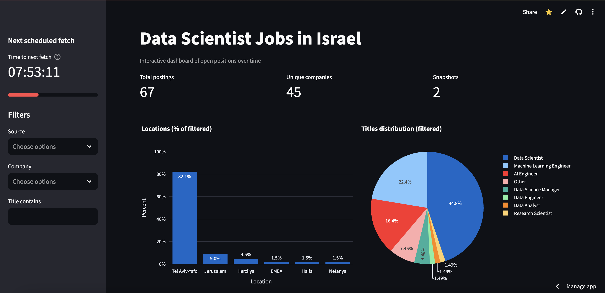

# Job Scraper DS

Automated system to collect and present data on open Data Scientist positions in Israel.

**Live demo**: https://job-scraper-ds-k24kqrim98fqo8zvskeuea.streamlit.app/

**Screenshot**:



## Features
- Scrapes every run from multiple sources (configurable)
  - Greenhouse boards API (no API key)
  - Lever postings API (no API key)
  - Optional: LinkedIn via SerpAPI Google Jobs (requires API key) — SerpAPI offers a free tier of 250 searches/month. See [SerpAPI pricing](https://serpapi.com/).
  - Optional: LinkedIn via SearchApi.io Google Jobs (requires API key)
  - Optional: LinkedIn via Playwright with your credentials (headless browser)
- Appends to a dynamic CSV with columns: `source, job_title, company, location, url, collected_at, snapshot_id`
- Interactive Streamlit dashboard with filters, trend over time, and a countdown to the next run
- Ready for cron or ad-hoc scheduling

## Quickstart
1. Clone and enter the repo, then setup:
   ```bash
   bash scripts/setup.sh
   ```
2. Create `.env` in the repo root (or use the pre-created one) and set values as needed:
   ```env
   # Timezone
   TZ=Asia/Jerusalem

   # Optional: data sources
   SERPAPI_API_KEY=
   SEARCHAPI_API_KEY=
   LINKEDIN_EMAIL=you@example.com
   LINKEDIN_PASSWORD=your-password
   LINKEDIN_HEADLESS=true
   LINKEDIN_MAX_JOBS=300         # recommended

   # Optional: S3 output from runner (uploads an aggregate archive)
   OUTPUT_BUCKET=your-bucket
   OUTPUT_PREFIX=snapshots/
   AWS_DEFAULT_REGION=us-east-1

   # Dashboard options
   USE_S3=true                  # read CSV from S3 if available
   ENABLE_FETCH_BUTTON=false    # set true only if you configure API_URL secret
   DATA_REFRESH_SECS=300        # UI auto refresh window for data cache (optional)

   # Dashboard self-enrichment (in-memory)
   SELF_ENRICH=true
   SELF_ENRICH_MODE=embed       # embed | flan
   HF_SENTENCE_MODEL=sentence-transformers/all-MiniLM-L6-v2
   HF_T2T_MODEL=google/flan-t5-small
   ENRICH_THRESHOLD=0.55

   # Countdown (sidebar) – how often to re-read next_run.json from S3
   SCHEDULE_HOURS=12
   NEXT_RUN_REFRESH_SECS=36000
   ```
3. Configure sources in `config/sources.yaml` (edit company slugs and enable/disable sources). For LinkedIn Playwright you can add:
   ```yaml
   linkedin_playwright:
     enabled: true
     query: Data Scientist
     location: Israel
     headless: true
     max_jobs: 300
     max_pages: 100
     time_budget_sec: 400
     # the scraper always targets at least this many new (unseen) URLs
     min_new: 10
     # time window for guest search (r86400=24h, r604800=7d)
     time_window: r604800
   ```
4. Run a scrape (today):
   ```bash
   python -m src.job_scraper.runner
   ```
   Backfill examples:
   ```bash
   python -m src.job_scraper.runner --as-of $(date -v-1d +%F)
   python -m src.job_scraper.runner --as-of $(date -v-2d +%F)
   ```
5. Launch the dashboard:
   ```bash
   streamlit run src/dashboard/app.py
   ```

## S3 Uploads (runner)
- The runner maintains a single aggregate file: `s3://$OUTPUT_BUCKET/$OUTPUT_PREFIX/archive.csv`.
- Each run appends and de-duplicates by `url` (keeps latest row per URL).
- Each run carries a unique `snapshot_id` (UTC timestamp), so multiple runs per day are distinct snapshots.
- The dashboard prefers `archive.csv` and falls back to `latest.csv` if present.

## Dashboard Data Sources
The dashboard chooses data in this order:
1. S3 (`archive.csv` preferred, then stable keys) when `USE_S3=true`
2. Local file `data/jobs.csv`
3. Remote CSV fallback (`DASHBOARD_DATA_URL`, defaults to repo raw CSV)

## Fetch Button (optional)
- Hidden by default. To enable:
  - Set env: `ENABLE_FETCH_BUTTON=true`
  - Add Secret: `API_URL` pointing to your backend job trigger
- If the button is enabled but `API_URL` is missing, a warning is shown. If disabled, nothing is shown.

## Countdown to Next Fetch (optional)
- Sidebar shows a live countdown by reading `s3://$OUTPUT_BUCKET/$OUTPUT_PREFIX/meta/next_run.json` (expects `{ "next_run_at": ISO8601 }`).
- Auto-updates the digits every second; data auto-refreshes when S3 object version or local mtime changes, or every `DATA_REFRESH_SECS` seconds.
- Requires `streamlit-autorefresh` (listed in `requirements.txt`).

## Self-Enrichment in the UI (optional)
- Set `SELF_ENRICH=true` to compute normalized columns on-the-fly for charts:
  - `SELF_ENRICH_MODE=embed` (default): sentence-transformers nearest-label
  - `SELF_ENRICH_MODE=flan`: small local FLAN-T5 classifier via `transformers`
- No files are written; enrichment is in-memory only. Charts also apply heuristics to collapse verbose titles and normalize cities.

## Snapshot semantics
- A snapshot is one run of the code (not one day). The runner writes a `snapshot_id` per row.
- The dashboard counts snapshots as:
  - Unique `snapshot_id` values
  - Plus unique `collected_at` for rows missing `snapshot_id` (legacy rows)
- The trend chart groups by `snapshot_id` timestamp when present, otherwise by `collected_at` date.

## LinkedIn Playwright specifics
- Uses the guest search endpoint with `sortBy=DD` and pagination (`start=0,25,50,...`) to fetch newest jobs first.
- Skips URLs already present in `archive.csv` to avoid duplicates across runs.
- Targets at least `min_new` fresh URLs each run before stopping (honors `max_jobs`, `time_budget_sec`, `max_pages`).

## AWS deployment (reference)
- See section above for architecture and IAM. Ensure the UI bucket/prefix matches the runner (`OUTPUT_*`).

## Scheduling
Use cron (every 12 hours example):
```cron
0 */12 * * * cd /path/to/job-scraper-ds && /path/to/python -m src.job_scraper.runner >> logs/scrape.log 2>&1
```
Or run ad-hoc with any interval using a process manager. If you maintain a scheduler in AWS, also write `meta/next_run.json` for the dashboard countdown.

## Data & Dashboard
- CSV path: `data/jobs.csv`. The file is append-only with de-duplication per `url`.
- Dashboard: `streamlit run src/dashboard/app.py` provides:
  - Filters by source, company, and title substring.
  - Chart of counts per snapshot.
  - Table of all postings (newest first).

## Notes
- Location normalization is keyword-based for Israel and can be tuned.
- Add more sources easily by adding new scrapers under `src/job_scraper/scrapers/` and wiring them in `runner.py`.

## License
MIT
